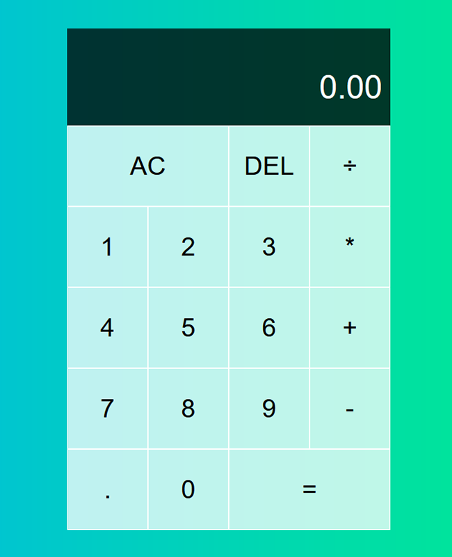

# Vanilla JavaScript Calculator 
## Link to live Calculator Application -  [Calculator](https://jakobcoding.github.io/JavaScript-Calculator/)

This project helped me learn some basic core fundamentals of JavaScript.

# Tech Stack
- HTML
- CSS
- JavaScript

